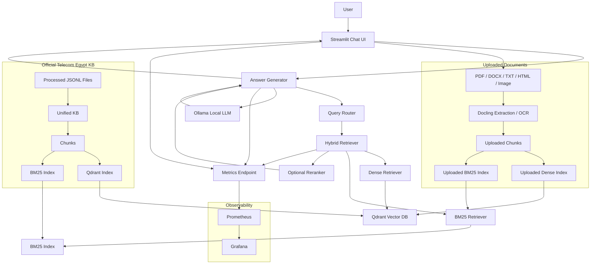

# Telecom Egypt Intelligent Assistant

A local, on-premise RAG assistant for Telecom Egypt / WE services.
The system answers customer questions using official Telecom Egypt website data and user-uploaded documents, with citations, hybrid retrieval, optional reranking, Streamlit UI, and Prometheus/Grafana observability.

---

## Table of Contents

* [Project Overview](#project-overview)
* [Main Features](#main-features)
* [Architecture](#architecture)
* [Repository Structure](#repository-structure)
* [Tech Stack](#tech-stack)
* [Required Ollama Models](#required-ollama-models)
* [Quickstart with Docker](#quickstart-with-docker)
* [Run Streamlit Locally](#run-streamlit-locally)
* [Build the Knowledge Base and Indexes](#build-the-knowledge-base-and-indexes)
* [Test Uploaded Documents](#test-uploaded-documents)
* [Prometheus and Grafana Observability](#prometheus-and-grafana-observability)
* [Evaluation and Validation](#evaluation-and-validation)
* [Cost Optimization Strategy](#cost-optimization-strategy)
* [Future Improvements](#future-improvements)

---

## Project Overview

The **Telecom Egypt Intelligent Assistant** is a Retrieval-Augmented Generation system designed to answer questions about Telecom Egypt / WE services, packages, devices, FAQs, and user-uploaded documents.

The assistant supports:

* Official Telecom Egypt website knowledge base.
* Uploaded user documents.
* Arabic and English queries.
* Hybrid search using dense vectors and BM25.
* Source-grounded answers with citations.
* Optional reranking for higher precision.
* Streamlit end-user chat interface.
* Prometheus and Grafana monitoring.
* On-premise/local deployment using Docker Compose and Ollama.

The project is designed as a practical, reviewer-friendly demonstration of a production-style RAG architecture.

---

## Main Features

### Official WE Knowledge Base

The system ingests structured official Telecom Egypt data from multiple website sections, including:

* FAQ records.
* Devices and products.
* Services, codes, fees, and terms.
* WE Home internet, landline, WE Air, WE Space, WE Sonic, and WE Life records.

The records are normalized into a unified knowledge base and indexed for retrieval.

---

### Uploaded Document RAG

Users can upload documents and ask questions about them.

Supported file types include:

* PDF
* DOCX
* TXT
* HTML
* Images / screenshots

Uploaded documents are processed locally, chunked, embedded, indexed, and retrieved using hybrid retrieval.

Example:

```txt
Uploaded document:
"This is a test document. The contract value is 500 EGP."

Question:
What is the contract value?

Answer:
The uploaded document says: "The contract value is 500 EGP." [1]

Source:
[1] Uploaded document — test_doc.txt
```

---

### Hybrid Retrieval

The system combines two retrieval methods:

1. **Dense retrieval** using Qdrant and local Ollama embeddings.
2. **Sparse retrieval** using BM25 keyword search.

The results are combined using Reciprocal Rank Fusion.

This gives the system the benefit of both:

* Semantic matching.
* Exact keyword/code/price matching.

This is especially important for telecom data because queries may include:

* USSD codes such as `*550#`
* Plan names
* Prices
* Quotas
* Speeds
* Device names
* Invoice/contract values in uploaded documents

---

### Answer Generation with Citations

The assistant generates grounded answers using retrieved sources.

Every answer is expected to include citations such as:

```txt
كود معرفة الرصيد هو *550#، ورسوم الخدمة 5 قروش. [1]
```

Sources are shown separately under the answer.

If the local generation model fails, times out, or does not follow citation requirements, the system falls back to a deterministic grounded answer using retrieved sources.

This keeps the final answer safe and source-backed.

---

### Streamlit End-User Interface

The Streamlit UI is designed for end users.

It shows:

* Clean chat interface.
* Retrieval-only source result cards by default.
* Source citations.
* Upload section.
* Source selector.

It does **not** show internal technical details such as:

* Model name.
* Reranking details.
* Scores.
* Debug logs.
* Retrieval internals.
* Fallback status.

By default, Streamlit uses retrieval-only mode for maximum grounding and reliability. This is especially useful when running lightweight local models, where generation can be slower or less consistent. Generation mode is still available by setting:

```env
RESPONSE_MODE=generation
```

---

### Observability

The system exposes Prometheus metrics and includes a Grafana dashboard for monitoring.

Tracked metrics include:

* Total queries.
* Query latency.
* Retrieval latency.
* Generation latency.
* Answer status.
* Fallback counts.
* Errors by stage.
* Reranking usage.
* Citation quality.

---

## Architecture



---

## Repository Structure

```txt
telecom-egypt-rag/
│
├── app/
│   └── streamlit_app.py
│
├── config/
│   ├── .env.example
│   ├── kb_sources.yaml
│   └── settings.py
│
├── data/
│   ├── evaluation/
│   ├── indexes/
│   ├── knowledge_base/
│   ├── logs/
│   ├── processed/
│   │   ├── devices/
│   │   ├── faq/
│   │   ├── services/
│   │   └── we_home/
│   └── uploads/
│
├── docker/
│   ├── docker-compose.yml
│   ├── prometheus.yml
│   └── grafana/
│       ├── dashboards/
│       └── provisioning/
│
├── scripts/
│   ├── build_unified_kb.py
│   ├── build_chunks.py
│   ├── build_bm25_index.py
│   ├── build_qdrant_index.py
│   ├── reset_indexes.py
│   ├── run_generation_eval.py
│   ├── run_retrieval_eval.py
│   ├── test_generation.py
│   ├── test_retrieval.py
│   ├── test_upload_ingestion.py
│   └── test_uploaded_retrieval.py
│
├── src/
│   ├── evaluation/
│   ├── generation/
│   ├── indexing/
│   ├── ingestion/
│   ├── logging/
│   ├── retrieval/
│   └── services/
│
├── Dockerfile
├── pyproject.toml
├── uv.lock
├── logo.png
└── README.md
```

---

## Tech Stack

| Layer                  | Technology                        |
| ---------------------- | --------------------------------- |
| UI                     | Streamlit                         |
| LLM Runtime            | Ollama                            |
| Generation Model       | `qwen3.5:0.8b`                    |
| Embedding Model        | `qwen3-embedding:4b`              |
| Vector Database        | Qdrant                            |
| Sparse Retrieval       | BM25                              |
| Reranking              | SentenceTransformers CrossEncoder |
| Reranker Model         | `Qwen/Qwen3-Reranker-0.6B`        |
| Document Processing    | Docling                           |
| OCR / Image Extraction | Docling-supported OCR             |
| Monitoring             | Prometheus + Grafana              |
| Dependency Management  | uv                                |
| Containerization       | Docker Compose                    |

---

## Prerequisites

Before running the project, make sure you have the following installed:

| Requirement            | Purpose                                                           |
| ---------------------- | ----------------------------------------------------------------- |
| Git                    | Clone the repository                                              |
| Docker Desktop         | Run Qdrant, Ollama, Prometheus, Grafana, and optionally Streamlit |
| Python 3.11+           | Run the local Streamlit/RAG app                                   |
| uv                     | Python dependency and virtual environment management              |
| Ollama                 | Local model runtime, used inside Docker                           |
| Recommended RAM        | 16 GB+                                                            |
| Recommended Disk Space | 10 GB+ free space for Docker images, models, and indexes          |

> The project can run fully locally/on-premise. No external LLM API is required.

---

## Clone the Repository

Clone the project from GitHub:

```bash
git clone https://github.com/ahmudmuhamad/telecom-egypt-rag
cd telecom-egypt-rag
```

---

## Install uv

If `uv` is not installed, install it first.

On Windows PowerShell:

```powershell
powershell -ExecutionPolicy ByPass -c "irm https://astral.sh/uv/install.ps1 | iex"
```

On macOS/Linux:

```bash
curl -LsSf https://astral.sh/uv/install.sh | sh
```

Then verify:

```bash
uv --version
```

---

## Setup Environment Variables

Copy the example environment file:

```bash
cp config/.env.example .env
```

On Windows PowerShell:

```powershell
Copy-Item config\.env.example .env
```

For the recommended local Streamlit mode, keep:

```env
QDRANT_URL=http://localhost:6333
OLLAMA_BASE_URL=http://localhost:11434
```

For full Docker mode, Docker Compose overrides these internally:

```env
QDRANT_URL=http://qdrant:6333
OLLAMA_BASE_URL=http://ollama:11434
```

## Required Ollama Models

The project uses local Ollama models.

Required models:

```txt
qwen3-embedding:4b
qwen3.5:0.8b
```

Pull them inside the Ollama container:

```bash
docker exec -it telecom_ollama ollama pull qwen3-embedding:4b
docker exec -it telecom_ollama ollama pull qwen3.5:0.8b
```

Check installed models:

```bash
docker exec -it telecom_ollama ollama list
```

Expected output should include:

```txt
qwen3-embedding:4b
qwen3.5:0.8b
```

The architecture supports model routing across small, medium, and large generation models.
For the lightweight local demo, the generation tiers can all point to `qwen3.5:0.8b` to reduce hardware requirements.

---

## Quickstart with Docker

Start the full demo:

```bash
docker compose -f docker/docker-compose.yml up --build
```

Then open:

```txt
http://localhost:8501
```

Main services:

| Service          | URL                             |
| ---------------- | ------------------------------- |
| Streamlit App    | <http://localhost:8501>           |
| Qdrant Dashboard | <http://localhost:6333/dashboard> |
| Ollama           | <http://localhost:11434>          |
| Prometheus       | <http://localhost:9090>           |
| Grafana          | <http://localhost:3000>           |

Default Grafana login:

```txt
username: admin
password: admin
```

If the Ollama models are not installed yet, pull them:

```bash
docker exec -it telecom_ollama ollama pull qwen3-embedding:4b
docker exec -it telecom_ollama ollama pull qwen3.5:0.8b
```

---

## Run Streamlit Locally

For development, you can run infrastructure in Docker and Streamlit locally.

Start infrastructure without the containerized Streamlit app:

```bash
docker compose -f docker/docker-compose.yml up -d qdrant ollama prometheus grafana
```

Run Streamlit:

```bash
uv run streamlit run app/streamlit_app.py
```

Open:

```txt
http://localhost:8501
```

In local mode:

```env
QDRANT_URL=http://localhost:6333
OLLAMA_BASE_URL=http://localhost:11434
RESPONSE_MODE=retrieval
```

In Docker mode:

```env
QDRANT_URL=http://qdrant:6333
OLLAMA_BASE_URL=http://ollama:11434
RESPONSE_MODE=retrieval
```

`RESPONSE_MODE=retrieval` is the default Streamlit mode. It displays the most relevant retrieved source cards directly. Set `RESPONSE_MODE=generation` to enable generated answers with citation validation and deterministic fallback.

---

## Build the Knowledge Base and Indexes

The official knowledge base is built from processed JSONL files.

Current source registry:

```txt
config/kb_sources.yaml
```

Build unified KB:

```bash
uv run python scripts/build_unified_kb.py
```

Build chunks:

```bash
uv run python scripts/build_chunks.py
```

Build BM25 index:

```bash
uv run python scripts/build_bm25_index.py
```

Build Qdrant vector index:

```bash
uv run python scripts/build_qdrant_index.py --recreate true --batch-size 1
```

Generated artifacts include:

```txt
data/knowledge_base/telecom_egypt_kb_v1.jsonl
data/knowledge_base/telecom_egypt_kb_v1_chunks.jsonl
data/indexes/bm25_official_kb_v1.pkl
data/indexes/bm25_manifest_v1.json
data/indexes/qdrant_index_manifest_v1.json
```

If official KB retrieval does not work in Docker, the Qdrant collection `telecom_all_sources_v1` is probably missing from the Qdrant volume. BM25 and chunk files live under `data/indexes` and `data/knowledge_base`, but Qdrant vectors live in Qdrant storage and must be created with:

```bash
uv run python scripts/build_unified_kb.py
uv run python scripts/build_chunks.py
uv run python scripts/build_bm25_index.py
uv run python scripts/build_qdrant_index.py --recreate true --batch-size 1
```

Then restart the Streamlit container:

```bash
docker compose -f docker/docker-compose.yml restart streamlit-app
```

Qdrant vector indexing uses the local Ollama embedding model and can take time.

Important rule:

```txt
Never mix embedding models between indexing and querying.
```

The official KB was indexed using:

```txt
qwen3-embedding:4b
```

So query embeddings must use the same embedding model.

---

## Knowledge Base Expansion

To add more website sections later:

1. Scrape and post-process a new section.
2. Save it as a processed JSONL file.
3. Add it to:

```txt
config/kb_sources.yaml
```

Example:

```yaml
- category: mobile
  path: data/processed/mobile/mobile_post_processed.jsonl
  enabled: true
  description: Mobile bundles, add-ons, and offers
```

Then rebuild:

```bash
uv run python scripts/build_unified_kb.py
uv run python scripts/build_chunks.py
uv run python scripts/build_bm25_index.py
uv run python scripts/build_qdrant_index.py --recreate true --batch-size 1
```

This design makes future data expansion a configuration-level change instead of a full architecture rewrite.

---

## Test Retrieval

Run terminal retrieval tests:

```bash
uv run python scripts/test_retrieval.py "كود معرفة الرصيد كام؟"
```

```bash
uv run python scripts/test_retrieval.py "What is the SIM swap cost?"
```

```bash
uv run python scripts/test_retrieval.py "What are WE Space recharge add-ons?"
```

With reranking:

```bash
uv run python scripts/test_retrieval.py "What is the yearly fee for WE Space Mega 3000 GB?" --rerank
```

Without reranking:

```bash
uv run python scripts/test_retrieval.py "What is the yearly fee for WE Space Mega 3000 GB?" --no-rerank
```

---

## Test Generation

Run terminal generation tests:

```bash
uv run python scripts/test_generation.py "كود معرفة الرصيد كام؟"
```

```bash
uv run python scripts/test_generation.py "What is the SIM swap cost?"
```

```bash
uv run python scripts/test_generation.py "What are WE Space recharge add-ons?"
```

Out-of-scope example:

```bash
uv run python scripts/test_generation.py "Compare Vodafone and WE prices"
```

The answer generator:

* Uses retrieved sources.
* Requires citations.
* Falls back to deterministic grounded answers if the local model fails or omits citations.
* Appends source references.

---

## Test Uploaded Documents

Create a simple test file:

```bash
echo "This is a test document. The contract value is 500 EGP." > data/uploads/test_doc.txt
```

Test upload ingestion:

```bash
uv run python scripts/test_upload_ingestion.py data/uploads/test_doc.txt
```

Test uploaded retrieval and generation:

```bash
uv run python scripts/test_uploaded_retrieval.py data/uploads/test_doc.txt "What is the contract value?"
```

Expected answer:

```txt
The uploaded document says: "The contract value is 500 EGP." [1]
```

Expected source:

```txt
[1] Uploaded document — test_doc.txt
```

You can also test screenshots/images through the Streamlit interface:

1. Open the app.
2. Upload an image or screenshot.
3. Select **Uploaded documents**.
4. Ask:

```txt
What is written in this image?
```

Uploaded document retrieval uses hybrid retrieval:

```txt
uploaded dense Qdrant retrieval + uploaded BM25 retrieval
```

---

## Source Modes

The Streamlit app supports three source modes:

| Mode                | Description                                             |
| ------------------- | ------------------------------------------------------- |
| Official WE sources | Search only official Telecom Egypt website data         |
| Uploaded documents  | Search only documents uploaded in the current session   |
| Both                | Search official sources and uploaded documents together |

Uploaded documents are scoped to the current session.

---

## Prometheus and Grafana Observability

The app exposes Prometheus metrics for the RAG pipeline.

In Dockerized reviewer mode, Prometheus scrapes `streamlit-app:8001`. If you run Streamlit locally outside Docker, change the `rag_app` target in `docker/prometheus.yml` to `host.docker.internal:8001`.

Metrics endpoint:

```txt
http://localhost:8001/metrics
```

Prometheus:

```txt
http://localhost:9090
```

Grafana:

```txt
http://localhost:3000
```

Grafana dashboard:

```txt
Telecom Egypt RAG Observability
```

Tracked metrics include:

* Total queries.
* Query rate.
* Retrieval latency.
* Generation latency.
* Total answer latency.
* Answer status.
* Fallback reasons.
* Errors by stage.
* Reranking usage.
* Citation quality.
* Last query source count.

Example Prometheus query:

```promql
telecom_rag_queries_total
```

Another example:

```promql
sum by (status) (telecom_rag_answers_total)
```

---

## Evaluation and Validation

The project includes validation scripts for generation, uploads, and observability.

### Generation Evaluation

Run:

```bash
uv run python scripts/run_generation_eval.py
```

Output:

```txt
data/evaluation/generation_eval_results_v1.csv
```

The generation evaluation checks:

* Route behavior.
* Citation validity.
* Expected answer token presence.
* Fallback behavior.
* Generation errors.

---

### Uploaded Document Validation

The uploaded document pipeline was validated with:

* TXT upload ingestion.
* TXT question answering.
* Image/screenshot OCR test.
* Uploaded document citation formatting.
* Source mode: Uploaded documents.
* Source mode: Both.

Example tested case:

```txt
Document:
This is a test document. The contract value is 500 EGP.

Question:
What is the contract value?

Answer:
The uploaded document says: "The contract value is 500 EGP." [1]

Source:
[1] Uploaded document — test_doc.txt
```

---

### Observability Validation

The observability stack was validated through:

| Component                                 | Result |
| ----------------------------------------- | ------ |
| Streamlit metrics endpoint                | Passed |
| Prometheus `rag_app` target               | Passed |
| Grafana datasource provisioning           | Passed |
| Grafana dashboard provisioning            | Passed |
| Query metrics update after user questions | Passed |

---

## Cost Optimization Strategy

The system includes several cost and latency optimization strategies.

### Query Routing

The router detects whether a query should go to retrieval, clarification, or rejection.

Example:

```txt
Compare Vodafone and WE prices
```

This can be rejected as out-of-scope in official-only mode without unnecessary generation.

---

### Pipeline Routing

The architecture supports different pipeline depths:

| Query Type           | Pipeline                                      |
| -------------------- | --------------------------------------------- |
| Simple factual query | Fast retrieval path                           |
| Medium query         | Standard hybrid retrieval                     |
| Complex query        | Larger retrieval depth and optional reranking |

---

### Model Routing

The architecture supports routing across:

```txt
small model → simple questions
medium model → normal questions
large model → complex reasoning
```

For the local demo, all generation tiers can be mapped to:

```txt
qwen3.5:0.8b
```

This keeps reviewer setup lightweight while preserving the model-routing architecture.

---

### Hybrid Retrieval Before Generation

Hybrid retrieval reduces the number of chunks sent to the model.

Instead of sending large documents, the system retrieves only the most relevant chunks using:

```txt
Qdrant dense search + BM25 keyword search + RRF fusion
```

---

### Context Compression

The answer generator compresses retrieved sources before generation.

It preserves important facts such as:

* Codes
* Prices
* Fees
* Quotas
* Speeds
* Citations

This reduces prompt size and improves response latency.

---

### Optional Reranking

Reranking improves precision but can be slower on CPU.

The system supports optional reranking through:

```txt
Qwen/Qwen3-Reranker-0.6B
```

If reranking is unavailable or disabled, the system falls back to hybrid retrieval.

---

### Deterministic Grounded Fallback

If generation fails, times out, or omits citations, the system returns a deterministic answer from retrieved sources.

This improves safety and avoids hallucinated, uncited answers.

---

### Future Caching

The project includes cache-related configuration flags and is designed to support:

* Exact query caching.
* Semantic caching.
* Prompt caching.
* Embedding caching.
* Uploaded file hash caching.

A future production version can use Redis for exact caching and Qdrant for semantic cache lookup.

---

## Future Improvements

### Full Website Coverage

The current system is designed so more Telecom Egypt website sections can be added through the source registry.

Future sections may include:

* Mobile packages.
* Business services.
* Offers.
* Support pages.
* Payment pages.
* Branches.
* Policies.
* Remaining product/service pages.

The expansion process is:

```txt
scrape new section
→ post-process to JSONL
→ add to config/kb_sources.yaml
→ rebuild unified KB
→ rebuild chunks
→ rebuild BM25
→ rebuild Qdrant
→ rerun validation
```

---

### Agentic Telecom Advisor

A future version can add an agentic layer on top of the RAG system.

Current system:

```txt
User asks → retrieve official sources → answer with citations
```

Future agentic system:

```txt
User asks → retrieve official data + understand user context → compare options → suggest next best action
```

Example:

```txt
User:
What is the Max plan?

Current RAG answer:
Explains Max plan details.

Future agentic answer:
Explains the Max plan, compares it with the user's current package and usage, then asks whether the user wants to upgrade, renew, or explore alternatives.
```

Possible future agents:

* Plan Recommendation Agent.
* Billing Support Agent.
* Troubleshooting Agent.
* Uploaded Document Analysis Agent.
* Action Agent for renewals, upgrades, or support tickets after user confirmation.

Important: any real account action should require explicit user confirmation.

---

### Stronger Production Deployment

Future deployment improvements may include:

* FastAPI backend.
* Authentication.
* User/session management.
* Persistent uploaded document collections.
* Redis caching.
* Advanced semantic cache.
* Role-based access.
* Production logging.
* GPU acceleration for embeddings/reranking/generation.
* CI/CD pipeline.
* Cloud or on-premise Kubernetes deployment.

---

## Useful Commands

Start full Docker demo:

```bash
docker compose -f docker/docker-compose.yml up --build
```

Start infrastructure only:

```bash
docker compose -f docker/docker-compose.yml up -d qdrant ollama prometheus grafana
```

Run Streamlit locally:

```bash
uv run streamlit run app/streamlit_app.py
```

Pull Ollama models:

```bash
docker exec -it telecom_ollama ollama pull qwen3-embedding:4b
docker exec -it telecom_ollama ollama pull qwen3.5:0.8b
```

Build official KB:

```bash
uv run python scripts/build_unified_kb.py
uv run python scripts/build_chunks.py
uv run python scripts/build_bm25_index.py
uv run python scripts/build_qdrant_index.py --recreate true --batch-size 1
```

Test official answer generation:

```bash
uv run python scripts/test_generation.py "كود معرفة الرصيد كام؟"
```

Test uploaded document RAG:

```bash
uv run python scripts/test_uploaded_retrieval.py data/uploads/test_doc.txt "What is the contract value?"
```

Cloud embedding workflow:

```bash
uv run python scripts/scrape_we_public_site.py --max-pages 500
uv run python scripts/qa_processed_sources.py --include-disabled
uv run python scripts/package_lightning_upload.py
```

Then build embeddings on Lightning AI and restore the downloaded Qdrant snapshot locally. See:

```txt
docs/cloud_embedding_workflow.md
```

Open services:

```txt
Streamlit:   http://localhost:8501
Qdrant:      http://localhost:6333/dashboard
Prometheus:  http://localhost:9090
Grafana:     http://localhost:3000
Ollama:      http://localhost:11434
```

---

## License

This project is developed as a technical assessment/demo project for a local RAG assistant over Telecom Egypt / WE data and uploaded documents.
